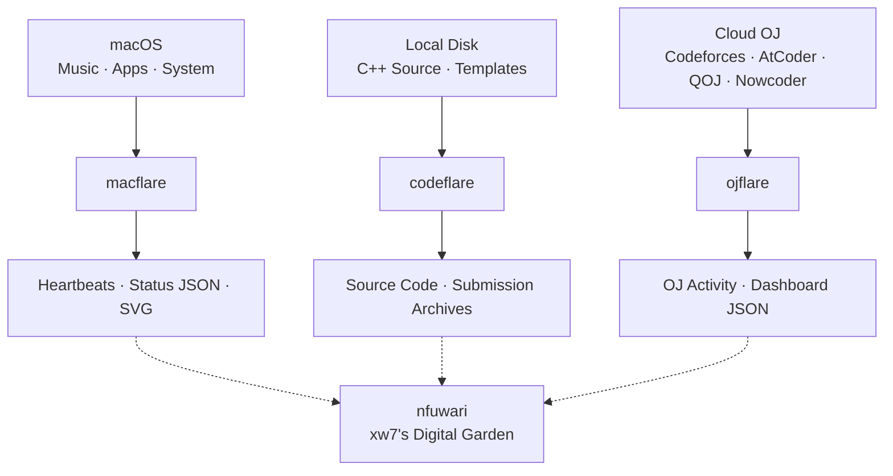

# 🥹 xw7

> Personal telemetry, competitive programming archives, and digital garden.

这里是 **xw7** 的个人基础设施与项目集合：用 **macflare** 记录设备状态，用 **codeflare** 沉淀竞赛代码，用 **ojflare** 整理刷题足迹，并围绕 **nfuwari** 构建自己的数字花园。

## 项目导航

| 项目 | 定位 | 主要内容 |
| --- | --- | --- |
| [macflare](https://github.com/xw7qwq/macflare) | 个人状态遥测 | 通过 macOS 原生工具采集 Apple Music、应用、电池与系统负载，由 Cloudflare 提供状态 JSON 和 SVG 徽章。 |
| [codeflare](https://github.com/xw7qwq/codeflare) | 竞赛编程归档 | 按平台与比赛整理 C++ 源码、算法模板和提交记录，保留可回顾的解题过程。 |
| [ojflare](https://github.com/xw7qwq/ojflare) | 在线评测记录 | 汇总 Codeforces、AtCoder、QOJ 与牛客公开编程练习记录，展示解题趋势与比赛进度，并提供 JSON 快照。 |
| [nfuwari](https://github.com/xw7qwq/nfuwari) | 数字花园 | 基于 Astro 与 Fuwari 的个人博客，承载文章、笔记与长期积累。 |

## 架构概览

三个项目分别连接设备、本地代码与在线评测平台；数字花园是这些记录统一展示的建设方向。

实线表示各项目的数据来源与产出；虚线表示面向数字花园的整合方向。具体接入方式与进度以各项目文档和实现为准。

## 这里记录什么

- **此刻的状态**：正在听的音乐、使用的应用，以及设备的运行情况。
- **持续的练习**：竞赛代码、提交记录和不同平台上的刷题积累。
- **长期的思考**：将零散的实践整理成文章与笔记，逐步丰富自己的数字花园。

## 了解与交流

各项目的使用方式、配置说明与开发文档请从上方仓库入口查看。项目相关的问题与建议，欢迎提交到对应仓库的 Issues；贡献前请阅读[组织贡献规范](https://github.com/xw7qwq/.github/blob/main/CONTRIBUTING.md)与[仓库维护约定](https://github.com/xw7qwq/.github/blob/main/docs/maintenance.md)，项目专用要求与许可证以各仓库说明为准。
