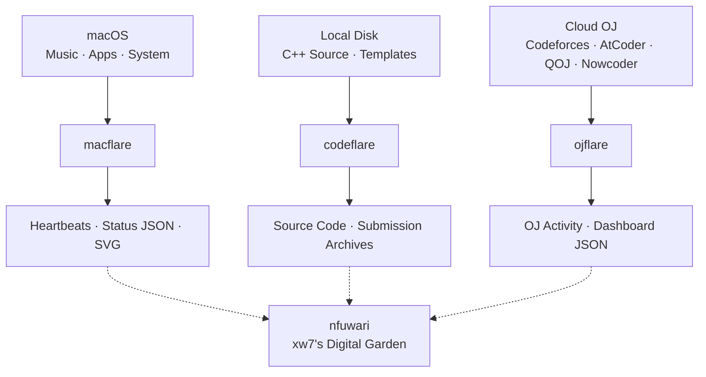

# 🥹 xw7

> Personal telemetry, competitive programming archives, and a digital garden.

**xw7** brings together personal infrastructure and projects: **macflare** for device activity, **codeflare** for contest code, **ojflare** for practice history, and **nfuwari** for articles and notes.

[Support](https://github.com/xw7qwq/.github/blob/main/SUPPORT.md) · [Contributing](https://github.com/xw7qwq/.github/blob/main/CONTRIBUTING.md) · [Security](https://github.com/xw7qwq/.github/blob/main/SECURITY.md) · [Maintainer guide](https://github.com/xw7qwq/.github/blob/main/docs/maintainer-guide.md)

## Projects

| Project | Purpose | Website and documentation |
| --- | --- | --- |
| [macflare](https://github.com/xw7qwq/macflare) | Collect music, app, and device activity with native macOS tools; serve a JSON API and SVG badges | [Website](https://macflare.lucius7.dev/) · [API](https://macflare.lucius7.dev/api) |
| [codeflare](https://github.com/xw7qwq/codeflare) | Browse C++ solutions, algorithm templates, and submissions by platform and contest | [Source browser](https://codeflare.lucius7.dev/) · [Documentation](https://codeflare.lucius7.dev/docs/) |
| [ojflare](https://github.com/xw7qwq/ojflare) | Track solving trends, ratings, and contests across platforms through public snapshots | [Dashboard](https://ojflare.lucius7.dev/) · [API](https://github.com/xw7qwq/ojflare/blob/main/docs/API.md) |
| [nfuwari](https://github.com/xw7qwq/nfuwari) | Publish articles and notes with Astro and Fuwari | [Blog](https://blog.lucius7.cn/) · [Writing guide](https://github.com/xw7qwq/nfuwari/blob/main/docs/WRITING.md) |

## Architecture

The three data projects connect devices, local code, and online judges. The digital garden is their planned shared home.

Solid arrows show current inputs and outputs. Dashed arrows show planned integration with the digital garden; each project's documentation and implementation define its current status.

## What lives here

- **Current activity:** music, apps, and device status.
- **Ongoing practice:** contest code, submissions, and progress across platforms.
- **Lasting notes:** articles and reflections on that work.

## Get involved

Use the relevant repository's Issues for questions and suggestions; see [Support](https://github.com/xw7qwq/.github/blob/main/SUPPORT.md) for links. Before contributing, read the [contribution guidelines](https://github.com/xw7qwq/.github/blob/main/CONTRIBUTING.md), [code of conduct](https://github.com/xw7qwq/.github/blob/main/CODE_OF_CONDUCT.md), and [maintenance conventions](https://github.com/xw7qwq/.github/blob/main/docs/maintenance.md). Each repository defines its own project requirements and license.
