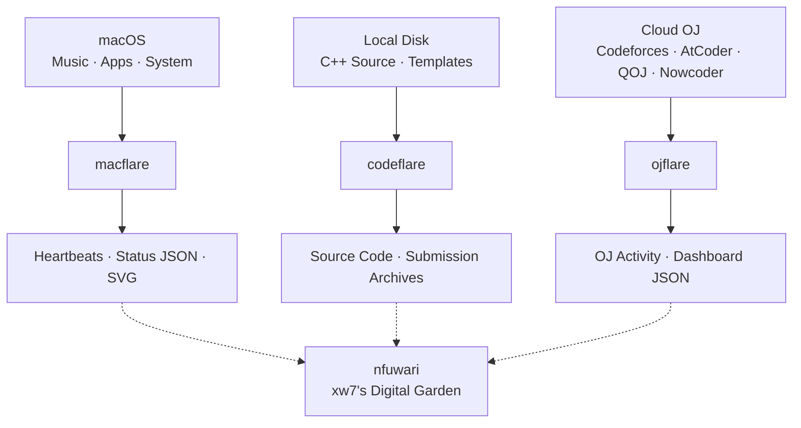

# 🥹 xw7

> Personal telemetry, competitive programming archives, and digital garden.

这里是 **xw7** 的个人基础设施与项目集合：用 **macflare** 记录设备状态，用 **codeflare** 沉淀竞赛代码，用 **ojflare** 整理刷题足迹，并围绕 **nfuwari** 构建自己的数字花园。

[使用与支持](https://github.com/xw7qwq/.github/blob/main/SUPPORT.md) · [参与贡献](https://github.com/xw7qwq/.github/blob/main/CONTRIBUTING.md) · [安全报告](https://github.com/xw7qwq/.github/blob/main/SECURITY.md) · [维护指南](https://github.com/xw7qwq/.github/blob/main/docs/maintainer-guide.md)

## 项目导航

| 项目 | 主要用途 | 网站与文档 |
| --- | --- | --- |
| [macflare](https://github.com/xw7qwq/macflare) | 用 macOS 原生工具采集音乐、应用和设备状态，提供 JSON API 与 SVG 徽章 | [网站](https://macflare.lucius7.dev/) · [API](https://macflare.lucius7.dev/api) |
| [codeflare](https://github.com/xw7qwq/codeflare) | 按平台与比赛检索 C++ 源码、算法模板和提交归档 | [源码阅读器](https://codeflare.lucius7.dev/) · [项目文档](https://codeflare.lucius7.dev/docs/) |
| [ojflare](https://github.com/xw7qwq/ojflare) | 查看多平台解题趋势、Rating 与比赛进度，读取公开统计快照 | [看板](https://ojflare.lucius7.dev/) · [API](https://github.com/xw7qwq/ojflare/blob/main/docs/API.md) |
| [nfuwari](https://github.com/xw7qwq/nfuwari) | 基于 Astro / Fuwari 的个人博客，承载文章与笔记 | [博客](https://blog.lucius7.cn/) · [写作指南](https://github.com/xw7qwq/nfuwari/blob/main/docs/WRITING.zh-CN.md) |

## 架构概览

三个项目分别连接设备、本地代码与在线评测平台；数字花园是这些记录统一展示的建设方向。

实线表示各项目的数据来源与产出；虚线表示面向数字花园的整合方向。具体接入方式与进度以各项目文档和实现为准。

## 这里记录什么

- **此刻的状态**：正在听的音乐、使用的应用，以及设备的运行情况。
- **持续的练习**：竞赛代码、提交记录和不同平台上的刷题积累。
- **长期的思考**：将零散的实践整理成文章与笔记，逐步丰富自己的数字花园。

## 了解与交流

项目相关的问题与建议请提交到对应仓库的 Issues，具体入口见[使用与支持](https://github.com/xw7qwq/.github/blob/main/SUPPORT.md)。贡献前请阅读[组织贡献规范](https://github.com/xw7qwq/.github/blob/main/CONTRIBUTING.md)、[协作行为准则](https://github.com/xw7qwq/.github/blob/main/CODE_OF_CONDUCT.md)与[仓库维护约定](https://github.com/xw7qwq/.github/blob/main/docs/maintenance.md)；项目专用要求与许可证以各仓库说明为准。
